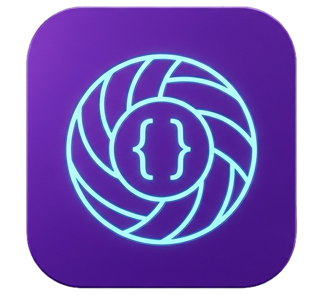

# Castaway

**Castaway** is an open-source web app that turns on-chain Solana IDLs into fully-typed SDK clients — in seconds.

Paste a program ID, fetch the on-chain IDL, and download a generated client powered by [Codama](https://github.com/codama-idl/codama).

[](https://vercel.com/new/clone?repository-url=https://github.com/dev-jodee/castaway&env=SOLANA_RPC_URL&envDescription=Optional%20private%20Solana%20RPC%20endpoint.%20Falls%20back%20to%20public%20mainnet%20if%20unset.)

---

## Features

- 🔍 **Fetch Solana IDLs** directly from the blockchain
- ⚡ **Generate SDK clients** for TypeScript (`@solana/kit`), TypeScript Umi, Rust, Go, and Dart
- 📦 **Download as a zip** — drop it straight into your project
- 🔎 **Preset programs** — popular protocols pre-loaded for quick access
- 🔐 **Server-side default RPC** for normal app usage, with an optional client-side custom RPC override

---

## Tech stack

|                |                                                             |
| -------------- | ----------------------------------------------------------- |
| Framework      | [Next.js 16](https://nextjs.org) (App Router)               |
| SDK generation | [Codama](https://github.com/codama-idl/codama)              |
| Solana client  | [@solana/kit](https://github.com/anza-xyz/kit) (web3.js v2) |
| Styling        | [Tailwind CSS v4](https://tailwindcss.com)                  |

---

## Getting started

### Prerequisites

- Node.js 22+
- npm

### Installation

```bash
git clone https://github.com/dev-jodee/castaway.git
cd castaway
npm install
```

### Environment variables

```bash
cp .env.example .env.local
```

| Variable               | Required    | Description                                                                                                                                |
| ---------------------- | ----------- | ------------------------------------------------------------------------------------------------------------------------------------------ |
| `SOLANA_RPC_URL`       | Optional    | RPC endpoint used by the server-side `/api/fetch-idl` route. Defaults to `https://api.mainnet-beta.solana.com`.                            |
| `NEXT_PUBLIC_BASE_URL` | Recommended | Canonical public URL of your deployment (no trailing slash), e.g. `https://castaway.lol`. Used for Open Graph and social preview metadata. |

If a user enters a custom RPC URL in the UI, that request is made directly from their browser instead of the server.

### Run locally

```bash
npm run dev
```

Open [http://localhost:3000](http://localhost:3000).

---

## Deploying to Vercel

This repo is configured for manual Vercel deploys. Pushes to `main` do not auto-deploy.

Preview deploy:

```bash
npx vercel
```

Production deploy:

```bash
npx vercel --prod
```

Set your environment variables in Vercel under **Settings → Environment Variables**:

- `SOLANA_RPC_URL`
- `NEXT_PUBLIC_BASE_URL`

The repository CI workflow only runs checks. It does not perform deployments.

---

## Adding a preset program

Preset programs live in [`data/presets.json`](./data/presets.json). Each entry looks like this:

```json
{
  "name": "Jupiter",
  "programId": "JUP6LkbZbjS1jKKwapdHNy74zcZ3tLUZoi5QNyVTaV4",
  "description": "Jupiter aggregator v6",
  "category": "DeFi"
}
```

**To submit a new preset:**

1. Fork the repo and create a branch: `git checkout -b preset/program-name`
2. Add your entry to `data/presets.json`
3. Make sure the program has an on-chain Solana IDL compatible with the app — test it first
4. `category` must be one of: `DeFi`, `Staking`, `NFT`, `Governance`
5. Open a PR with the title: `feat: add [Program Name] preset`

See [CONTRIBUTING.md](./CONTRIBUTING.md) for more details.

---

## Contributing

All contributions are welcome: bug fixes, presets, features, and documentation improvements. Read [CONTRIBUTING.md](./CONTRIBUTING.md) before opening a PR.

---

## License

MIT © [dev-jodee](https://github.com/dev-jodee)
